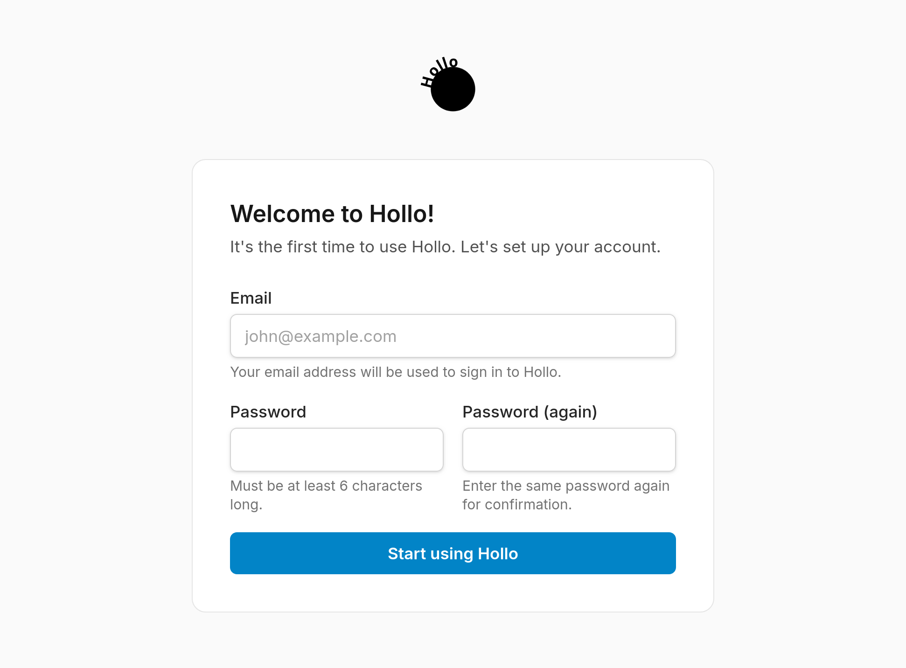
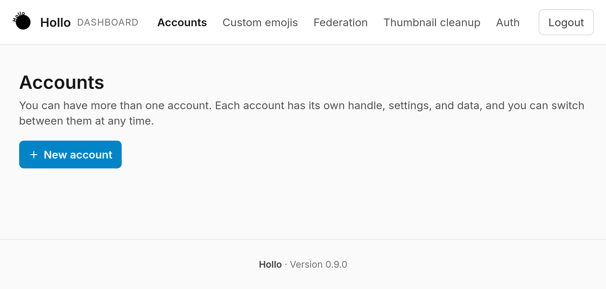
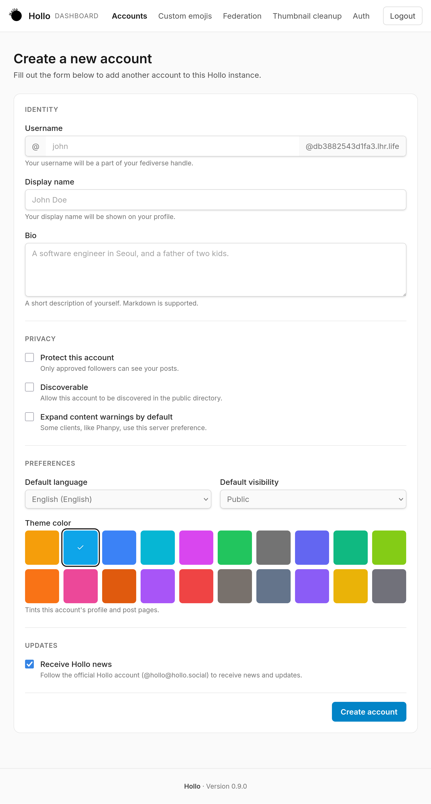
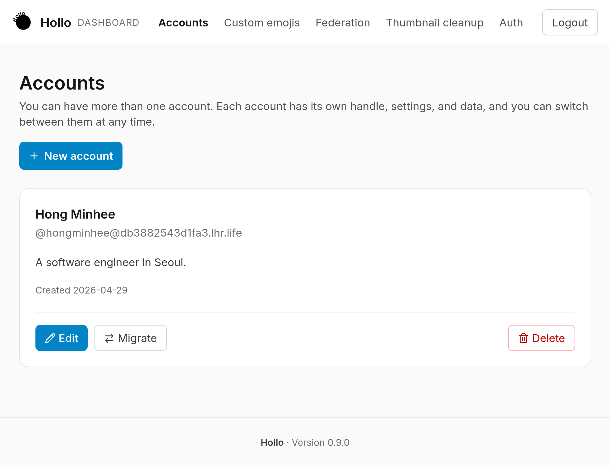
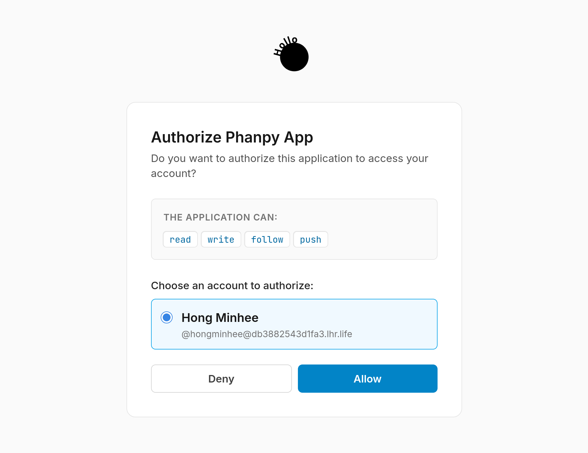

import { Aside, Steps } from "@astrojs/starlight/components";

<Aside type="caution" title="注意！">
  在開始設定 Hollo 之前，您需要決定一個網域名稱，並確保該網域名稱已設定並指向您的伺服器。
  因為一旦 Hollo 設定完成，您將無法更改網域名稱。
</Aside>

安裝 Hollo 後，您需要進行設定。本指南將引導您在伺服器上設定 Hollo。

<Steps>
 1. 訪問 **https://<var>yourdomain</var>/setup**，其中 <var>yourdomain</var> 是您的網域名稱。

 2. 設定您的登入憑證。

    

 3. 您將看到空的 **Accounts**（帳號）頁面。點擊 **Create a new account**（建立新帳號）按鈕。

    

 4. 填寫表單以建立您的帳號。除 **Username**（使用者名稱）欄位外，其他欄位可以在之後更改。

    

 5. 建立帳號後，您將看到 **Accounts**（帳號）頁面列出了您的帳號。

    

 6. 由於 Hollo 是無介面的，您需要使用相容 Mastodon 的用戶端應用程式，例如 [Phanpy]，來與其互動。這裡以 Phanpy 為例。

    訪問 **https://phanpy.social/** 並點擊 **使用 Mastodon 登入** 按鈕開始登入。

 7. 輸入您的 Hollo 網域名稱並點擊 **繼續**。

    

 8. 此時，您可能需要登入到您的 Hollo 帳號。輸入您的使用者名稱和密碼並點擊 **Sign in**（登入）。

    如果不需要登入，請跳到下一步。

 9. 您將看到 **Authorize Phanpy**（授權 Phanpy）頁面。點擊 **Allow**（允許）以授權 Phanpy 存取您的 Hollo 帳號。

    

10. 這樣就完成了！您現在已使用 Phanpy 登入到您的 Hollo 帳號。

    時間軸一開始會是空的，但您可以開始發布內容和追蹤其他用戶。如果您想追蹤官方 Hollo 帳號，請搜尋 `@hollo@hollo.social` 並在個人資料頁面上點擊 *追蹤* 按鈕。

    盡情享受吧！

    

[Phanpy]: https://phanpy.social/
</Steps>
